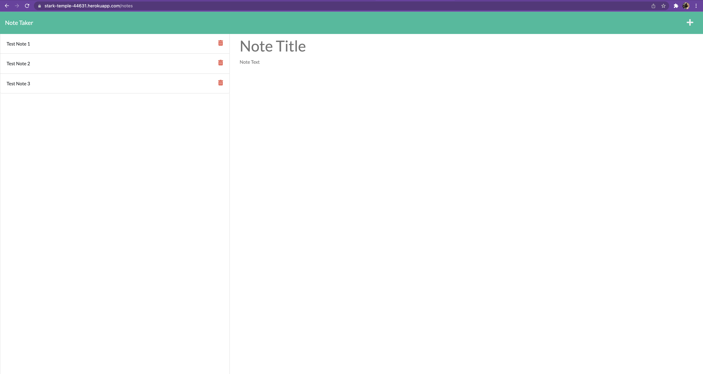

# JDLNotetakerApp

[]

## Table of Contents

- [Description](#description)
- [Technologies Used](#technologies-used)
- [Demonstration](#demonstration)
- [Setup](#setup)
- [Usage](#usage)
- [Project Updates](#project-updates)
- [Project Status](#project-status)
- [Have any Questions](#questions)
- [License](#license)

## Project Status

#### The status of Project JDLNotetakerApp is currently:

- ##### _complete_

#### Why is is the status of the Project _complete_:

- ##### mission accomplished

## Project Updates

none, theyre working perfectly

## Demonstration

### Screenshot

### Live Demo

## Description

- This applications is used to read, write and delete notes from a Database so users can organize thier thoughts and keep track of tasks they need to complete.

## Technologies Used

- JS, html, css, Express, FS, Path, and UUID

## Setup

To use this application, you must have the following technologies installed:

- A webbrowser such as Chrome or Safari or other popular webserver

## Usage

- visit [JDLNotetakerAPP](https://stark-temple-44631.herokuapp.com/). Enter a NOte, click the Save Icon on the top right of the screen, click the note in the side bar, and delete when needed.

## Questions

This application was created by: [Jason Lutz](mailto:LutzJason92@gmail.com)

- I encourage you to send me an email if you have any questions or comments.

## Contributors

Thank you to these GitHub users for thier contributions:

- https://github.com/LutzJason92

## License

- This appplication is currently using a mit license.
